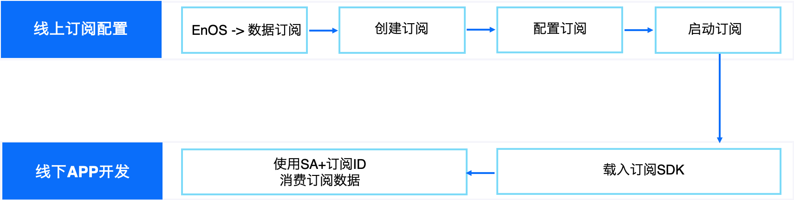

# 管理数据订阅
数据订阅功能是EnOS为提高应用API调用效率而推出的一种主动推送服务，推送内容包括（资产实时上送数据、资产告警数据、资产主数据等信息），基于该推送服务，应用获取资产数据不需再不停轮询API，仅需在接收到EnOS推送的消息时调用API获取数据即可，大大提高API调用效率和降低API使用费用。

## 数据订阅使用流程

## 创建订阅
进入EnOS控制台，在**数据订阅**页面，点击**添加订阅**按钮进入订阅配置页面，选择需要的订阅的数据类型并配置相关的筛选条件，点击**保存**即可完成订阅创建。

## 配置订阅
**订阅类型**

EnOS 提供不同数据源的订阅服务供开发者选择，针对不同的数据源，订阅配置会稍有不同。以下是EnOS订阅服务支持的订阅数据源：

- 实时数据：实时数据是指资产上送或者计算产生的带时间戳的测点数据
- 告警数据：告警是指针对实时数据设置一定的告警规则，根据这些告警规则产生的告警数据

**订阅ID**

每个订阅都必须要有全局唯一标识ID，数据订阅配置模块支持用户自定义ID，也支持系统自动生成ID。ID填写时只支持英文大小写、下划线、中横线。

**SA账号**

每一个订阅Topic都必须关联一个[SA账号](https://www.envisioniot.com/docs/app-development/zh_CN/latest/managing_apps.html)，用以Consumer鉴权及数据鉴权。

**订阅客户**

根据SA的客户数据权限（应用购买关系），可选择需要订阅的客户数据。

**模型条件**

1. 实时数据过滤条件
   - 模型测点过滤条件：支持用户设置模型测点过滤条件
   - 设备标签过滤条件：支持用户根据设备标签过滤数据
2. 告警数据过滤条件
   - 模型过滤条件：支持用户设置模型过滤条件
   - 设备标签过滤条件：支持用户根据设备标签过滤数据

## 启动订阅
配置好订阅Topic后，可点击**启动**按钮对Topic进行数据订阅，开启Topic后，Producer会开始向Topic里面写入数据。

## 删除订阅

在订阅列表中，点击订阅Topic的**删除**按钮，可删除订阅Topic（只有已暂停的Topic才能删除），删除动作不可恢复。
